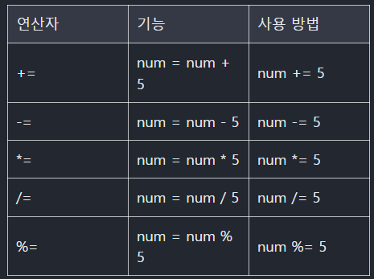

## 01. 기초

### 몰랐거나 중요한건 항상 기록하기

## 자료형

1. 원시타입

- 한번에 하나의 값을 가지는 타입
  (숫자, 문자, boolean, null, undefined ...)

2. 비원시타입

- 한번에 여러개의 값을 가지는 타입 (객체)

--

## 형변환

1. 묵시적 형 변환

-, \* , / 는 숫자로 추론 2. 명시적 형 변환
자동으로 적절하게 타입을 변경 해줌

2. 명시적 형 변환

- 더하기(+) 는 직접 의도적 으로 자료형 을 변환시키는 것

```
// 숫자형
let number = "javaScript" / 10;
console.log(number); //NaN 부정확, 0으로 나누는 연산

//BigInt (숫자형으로 표현하지 못하는 큰 수)
let bigNum1 = 99999999999999999n;
let bigNum2 = BigInt("99999999999999999");
console.log(typeof bigNum1);
console.log(typeof bigNum2);

//명시적형변환
let num1 = parseInt("15"); //'15'
let num2 = 5;
console.log(num1 + num2);

```

---

## 연산자

1. 산술 연산자

후위 전산자 : 특정 변수의 값에 1을 더하거나 빼기 바로 직전의 값
전위 연산자 : 특정 변수의 값에 1을 더하거나 뺀 결과값

```
let num = 10;
console.log(num++); //후위 연산 10
console.log(num); // 11
console.log(++num); //전위 연산 12
```

2. 대입 연산자
   
